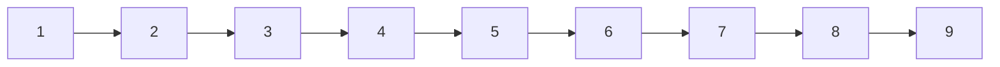
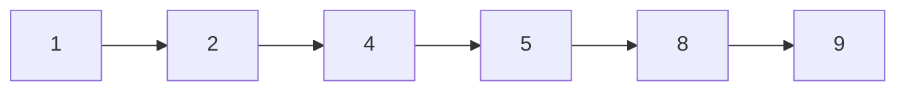

# idmanager
Repository for IdManager open source project

# The problem

Imagine that you want to have an array of numbers, starting from 1,2,3...N. Let say N = 1 000 000.  
There are many excellent data structures for it like lists, maps etc.

Then somebody removed some of the numbers from your list. For example 10000 of them, from any position. So you have a list with a gaps and you don't know where the gaps are located.
  
Now, you would like to put the numbers back to the list, but you want to put
them back in ascending order.    

Let inspect how we can store such information about storing the numbers and
the gaps (with some information about its limitations):

## LinkedList

LinkedList with removed items:

## ArrayList

Initial array list:  

| 1 | 2 | 3 | 4 | 5 | 6 | 7 | 8 | 9 |
|---|---|---|---|---|---|---|---|---|

ArrayList with removed items:

1. Case with remove:

| 1 | 2 | 4 | 5 | 8 | 9 | _ | _ | _ |
|---|---|---|---|---|---|---|---|---|

or:

2. Case with marking removed item:

| 1 | 2 | -1 | 4 | 5 | -1 | -1 | 8 | 9 |
|---|---|---|---|---|---|---|---|---|

## Tree

## BitSet
(For simplicity one bucket in the doc has 3 bits)

| 1,1,1 | 1,1,1 | 1,1,1 |  
|----|---|---|  

BitSet with removed items:

| 1,1,1 | 0,1,0 | 0,1,1 |  
|----|---|---|  

## BitSet with additional data structure to store removed elements

| 1,1,1 | 1,1,1 | 1,1,1 |  
|----|---|---|  
